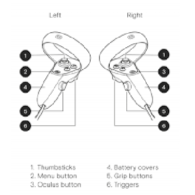

# oculus

## tests
### raycaster
* [raycaster_0_base](https://eminet666.github.io/eminet_VR/x_oculus/raycaster_0_base.html)
* [raycaster_1_proprietes](https://eminet666.github.io/eminet_VR/x_oculus/raycaster_1_proprietes.html)
* [raycaster_2_geometrie](https://eminet666.github.io/eminet_VR/x_oculus/raycaster_2_geometrie.html)
* [raycaster_3_model](https://eminet666.github.io/eminet_VR/x_oculus/raycaster_3_model.html)

### laser    
* [laser_0_base](https://eminet666.github.io/eminet_VR/x_oculus/laser_0_base.html)
* [laser](https://eminet666.github.io/eminet_VR/x_oculus/laser.html)

### oculus controls

* [oculus_trigger](https://eminet666.github.io/eminet_VR/x_oculus/oculus_0_trigger.html)
* [oculus_buttons](https://eminet666.github.io/eminet_VR/x_oculus/oculus_1_buttons.html)
* [oculus_thumbstick](https://eminet666.github.io/eminet_VR/x_oculus/oculus_2_thumbstick.html)
* [oculus_movement-controls](https://eminet666.github.io/eminet_VR/x_oculus/oculus_3_movement-controls.html)
<!-- * [test](https://aframe.io/aframe/examples/test/laser-controls/) -->

## liens
### docs
* [doc controleurs_fr](https://sodocumentation.net/aframe/topic/10112/controls--component-)
* [aframe extras](https://github.com/n5ro/aframe-extras)
* [movement-controls](https://github.com/n5ro/aframe-extras/tree/master/src/controls)

les composants **cursor**, **xxx-controls** sont construits à partir du composant **raycaster**

### components
* [raycaster](https://github.com/aframevr/aframe/blob/master/docs/components/raycaster.md)
* [laser-controls](https://github.com/aframevr/aframe/blob/master/docs/components/laser-controls.md)
* [oculus-touch-controls](https://github.com/aframevr/aframe/blob/master/docs/components/oculus-touch-controls.md)
* [tracked-controls](https://github.com/aframevr/aframe/blob/master/docs/components/tracked-controls.md)
* [keyboard-controls](https://github.com/n5ro/aframe-extras/issues/149)
* [thumb controls](https://github.com/supermedium/superframe/tree/master/components/thumb-controls/)
* [controls](https://github.com/n5ro/aframe-extras/tree/master/src/controls)
* [super hands](https://github.com/wmurphyrd/aframe-super-hands-component)

### autres
* [déplacement le long d'un chemin](https://github.com/protyze/aframe-alongpath-component)
* [interactions mobile](https://ar-js-org.github.io/AR.js-Docs/ui-events/)

### exemples
